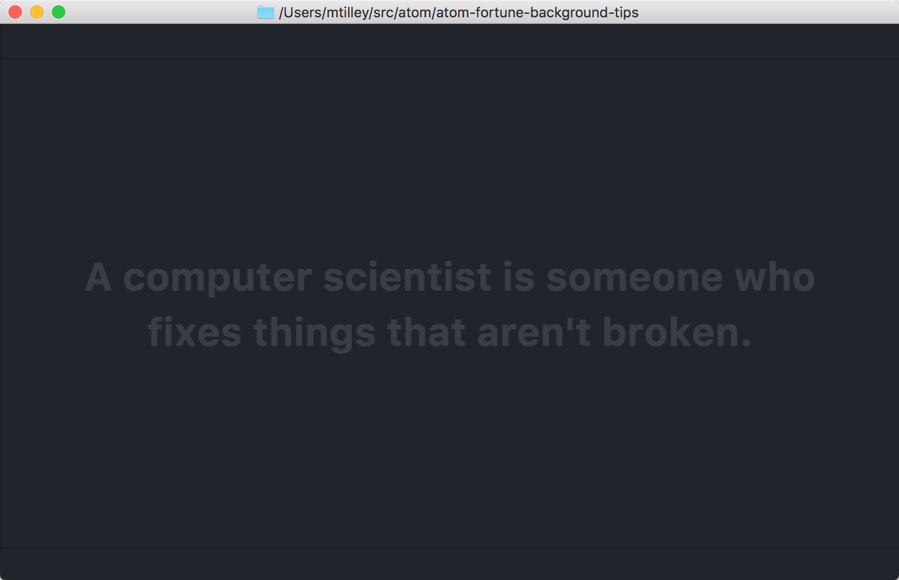

# Fortune Background Tips

Displays output from the 'fortune' program in the background when there are no editors open.

## Installation

Make sure you have `fortune` installed. If you want to customize the path to `fortune` or the arguments passed to it, check the `fortune-background-tips` settings in the Settings panel.
